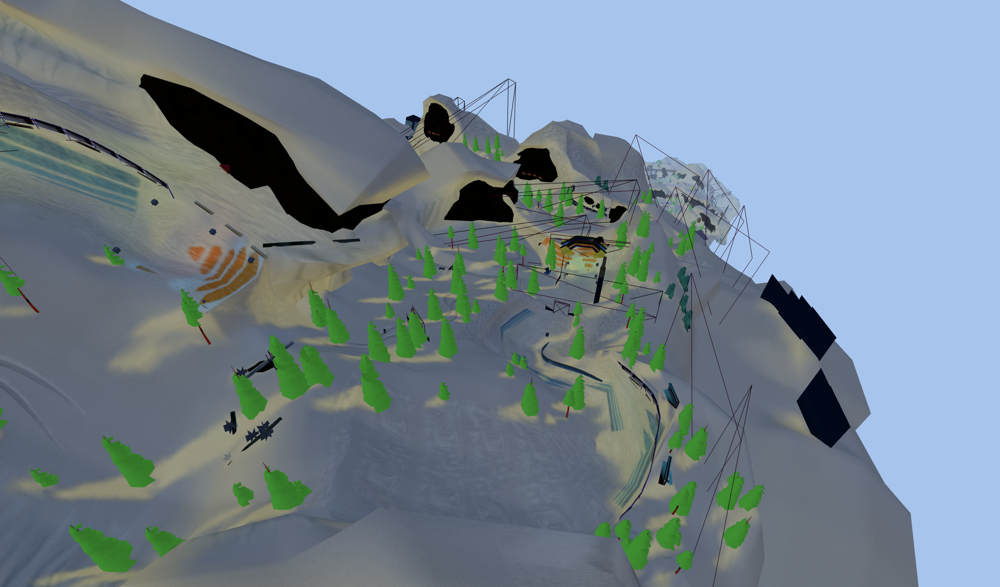

# ThreeJSSX

A .NET + Three.js web app that extracts SSX3 PS2 level data and renders the tracks in the browser.



---

## Implementation

1. Mounts the SSX3 PS2 ISO and extracts `BAM.BIG`
2. Parses 49 track/zone levels using [SSX-Library](https://github.com/GlitcherOG/SSX-Library)
3. Tessellates Bezier terrain patches into triangle meshes with UVs, normals, and lightmap atlas UVs
4. Parses raw MDR chunks to recover per-section material data
5. Resolves textures sections
6. Detects and tags triggers
7. Exports levels as self-contained `.glb`s with terrain patches + instanced models + lightmaps
8. Renders the result in the browser via Three.js

## Requirements

- .NET 10
- An SSX3 PS2 ISO

## Setup

```bash
git clone --recurse-submodules https://github.com/andersfischern/ThreeJSSX.git
cd ThreeJSSX

cp YOUR_SSX_3_PS2_ISO 'ISO/SSX 3.iso'

cd ThreeJSSX
dotnet run
```

Then open `http://localhost:5000` in your browser.

Note: All 49 zones are extracted from the ISO when the page loads. This takes ~2 minutes. Subsequent runs use the cache.
Per-level GLBs are generated on first click and cached. Large tracks take 3–6 seconds to generate.

## Submodule customisation - required

Two internal types from SSX-Library are needed to re-implement the SSB chunk-walking loop and decompress MDR chunks on the consumer side:

| Type | Reason |
|---|---|
| `SSX_Library.Internal.Refpack` | Decompress RefPack-compressed `CEND` chunks in `.ssb` files |
| `SSX_Library.Internal.Utilities.StreamUtil` | All the binary reads used during chunk walking (`ReadString`, `ReadUInt32`, `ReadInt24`, …) |

Otherwise MDR parsing isn't possible and per-section material data would be lost. Every instance model would therefore fall back to a single guessed texture instead of per-section textures.

The submodule needs to declare an `InternalsVisibleTo` attribute exposing these internals to the `ThreeJSSX` assembly. Make this change to `SSX-Library/SSX-Library/SSX-Library.csproj`:

```xml
<ItemGroup>
  <InternalsVisibleTo Include="ThreeJSSX" />
</ItemGroup>
```

## Running

### Clean everything and start server

```bash
pkill -9 -f ThreeJSSX 2>/dev/null; rm -rf "$TMPDIR/ThreeJSSX" ThreeJSSX/wwwroot/maps/glb && cd ThreeJSSX && dotnet run
```

### Re-export a single GLB

Delete the cached file and click it again in the sidebar:

```bash
rm ThreeJSSX/wwwroot/maps/glb/<LevelName>.glb
```

Or via the API:

```bash
curl -X DELETE http://localhost:5000/api/levels/<LevelName>/glb
```

### Re-export all GLBs

```bash
curl -X DELETE http://localhost:5000/api/cache/glb
```

Then click any level in the sidebar to regenerate on demand.

### Re-extract level data from ISO

If you want to re-parse everything from the ISO (e.g. after updating SSX-Library):

```bash
curl -X POST http://localhost:5000/api/levels/extract
```

This deletes the extracted data and re-runs the full extraction (~2 min) including raw MDR chunk dumps. GLBs are unaffected - delete them separately if needed.

## Project structure

```
ThreeJSSX/
├── ThreeJSSX/                  # ASP.NET Core web app
│   ├── Program.cs              # Minimal API endpoints
│   ├── Services/
│   │   ├── IsoService.cs       # ISO mounting, BIG extraction, SSB parsing
│   │   ├── MdrExtractor.cs     # Re-walks SSBs to save raw MDR chunk bytes per prefab
│   │   ├── PatchTessellator.cs # Bezier 4×4 → smooth triangle mesh + lightmap atlas UVs
│   │   └── MapGlbExporter.cs   # Level → GLB assembler (patches + instances + per-section textures + lightmaps)
│   └── wwwroot/
│       ├── index.html          # Three.js viewer
│       └── maps/glb/           # GLB cache
├── SSX-Library/                # Git submodule - GlitcherOG/SSX-Library
└── ISO/                        # Place SSX 3.iso here (gitignored)
```

## API reference

| Method | Endpoint | Description |
|--------|----------|-------------|
| `GET` | `/api/levels` | List all extracted zones (triggers extraction on first call) |
| `GET` | `/api/levels/{name}/glb` | Serve GLB for a zone (generates and caches on first request) |
| `POST` | `/api/levels/extract` | Force full re-extraction from ISO |
| `DELETE` | `/api/levels/{name}/glb` | Delete cached GLB for a level |
| `DELETE` | `/api/cache/glb` | Delete all cached GLBs |

The viewer also reads `?map=<LevelName>` from the URL to load a specific level on startup, and writes the current selection back to the URL so it can be bookmarked or shared.

## Controls

**Orbit mode**:

| Action | Control |
|--------|---------|
| Rotate | Left-drag |
| Zoom | Scroll |
| Pan | Right-drag |

**Fly mode**:

| Action | Control |
|--------|---------|
| Forward / strafe | W / A / S / D |
| Look | Mouse |
| Up | Space |
| Down | C (or Ctrl) |
| Boost (4× speed) | Shift |
| Return to orbit | Esc |
